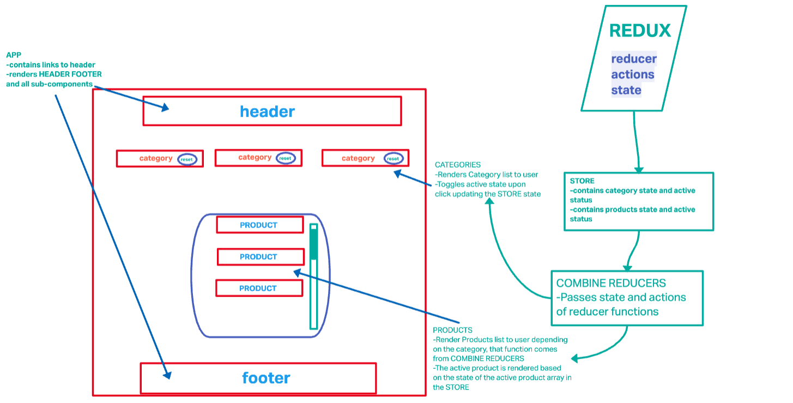

# Storefront APP

This is a web application that allows users to interact with an e-Commerce storefront using React with Redux, coupled with a live API server.

## Current Deployment

[Check out the Storefront Web App!](https://tiarabcodes1.github.io/storefront/)

## During this phase the following milestones were reached

During this phase of the web application user is able to render a list of products depending on the chosen category.

- Render available categories 
- Render available products that correspond to that category
- Add or Deduct product count

## WhiteBoard

## How to use this as a template

### Installation

- Install [NPM](https://www.npmjs.com/) onto your command line
- Chose Code above the repo and enter this command into your terminal:
    `git clone https://github.com/tiarabcodes1/storefront.git`
- `cd storefront`
- `npm install`

### Usage

- Initialize the package via `npm start`

## **Features found in this application**

**Category selectors**

- These render their respective products to users.
- Each category has a deactivate button that clears the products if desired. 

### Author & Contributors

`Author`: Tiara Brown

